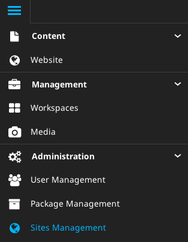
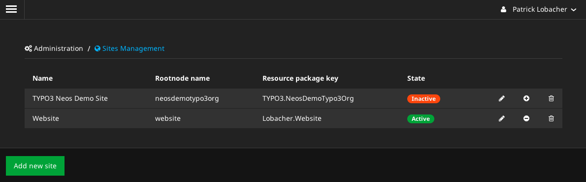
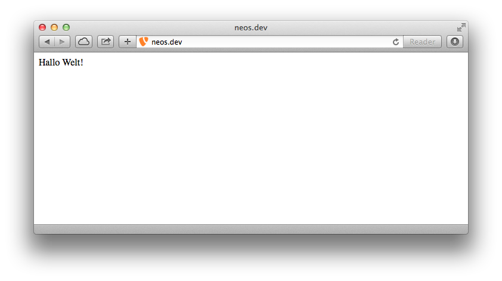

# TypoScript 2.0 Basics

Um die Basics von TypoScript zu erforschen, benötigen wir ein lauffähiges TYPO3 Neos. Klicke hierzu links auf das Menü-Symbol und wähle ganz unten **Sites Management** aus.



Nun deaktivieren wir die (eventuell bestehende) Site **TYPO3 Neos Demo Site** durch Klick auf das Minus-Symbol ganz rechts. Über **Add new site** legen wir anschließend eine neue Site an. Dort vergeben wir folgende Daten:

**Package Key:**

> Lobacher.Website

**Site Name:**

> website



Nun öffnen wir die Datei `Packages/Sites/Lobacher.Website/Resources/Private/TypoScripts/Library/Root.ts` und schreiben folgenden Code ganz ans Ende der Datei:

```
page >
page = 'Hallo Welt!'
```

Im Frontend sollte nun **Hallo Welt!** erscheinen.



Wir haben nun die Voraussetzungen geschaffen, um uns TypoScript 2.0 etwas genauer anzusehen, ohne den Overhead von Neos in der Ausgabe zu haben.
