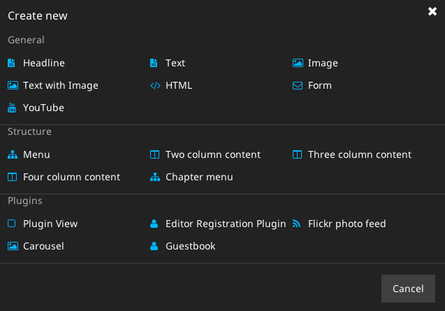

# TYPO3 Neos Nodetypes - TypoScript Objekte & Yaml

Wie im Kapitel [TypoScript Rendering](../tsrendering/README.md) aufgezeigt, werden zusätzlich zu den [TYPO3.TypoScript Objekten](tsbasics/README.md) und den [TYPO3.Neos Objekten](tsneos/README.md) auch `TYPO3.Neos.NodeTypes` Objekte geladen, bevor der individuelle TypoScript Code geparst wird.

Dazu wird zunächst einmal die Datei `Packages/Application/TYPO3.Neos.NodeTypes/Resources/Private/TypoScript/Root.ts2` geladen und anschließend die zugehörige Datei `Packages/Application/TYPO3.Neos.NodeTypes/Configuration/NodeTypes.yaml`.

Während die TypoScript-Datei - wie üblich - Prototypen definiert, ist die Yaml-Datei für die Konfiguration der Objekte - vor allem im Hinblick auf das Benutzerinterface - zuständig. Hier geht es darum die richtigen Felder an der richtige Stelle im Backend zur Verfügung zu stellen.

## TypoScript ##

Sobald man ein neues Inhaltselement einfügen will, erhält man zunächst den sogenannten *New Content Element Wizard*:

Das innerhalb von `TYPO3.Neos.NodeTypes` aufgelistete TypoScript konfiguriert letztlich diese Elemente und zudem ebenfalls die NodeTypes der Seiten - also generell allen NodeTypes.
