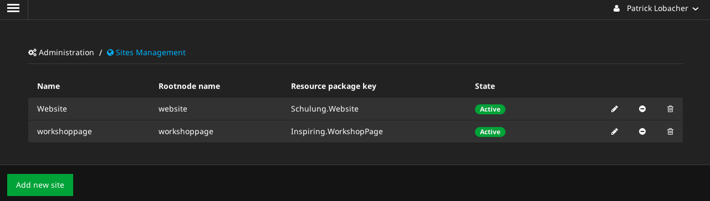
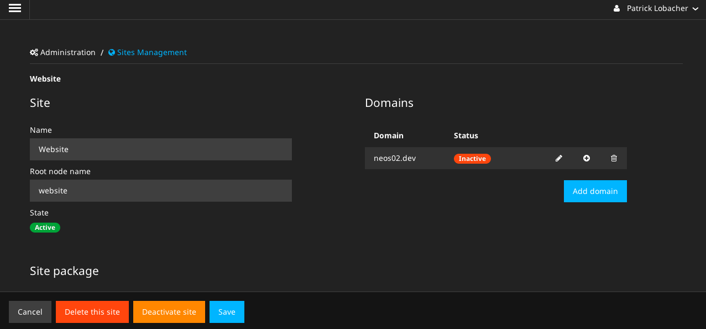

# Domain

Ruft man die Website im Frontend auf, wird per default nur die letzte Site berücksichtigt. Will man die verschiedenen Sites gezielt ansteuern, so muss man mit **Domains** arbeiten.

Die Syntax von der Kommanozeile aus lautet:

```
./flow domain:add <Rootnode name> <domain>
```

Den **Rootnode Name** (bzw. auch in manchen Listen als **Node name** bezeichnet) kann man entweder über die Liste der Site ermitteln oder aber per `./flow site:list`:



Nun kann man beispielsweise die obigen beiden Site je einer Domain zuordnen:

```
$ ./flow domain:add workshoppage neos01.dev
Domain created
$ ./flow domain:add website neos02.dev
Domain created
```

Wenn es sich hierbei um interne Domains handelt, müssen diese noch in die Hosts-Datei `/etc/hosts` eingetragen werden:

```
127.0.0.1 neos01.dev
127.0.0.1 neos02.dev
```

Die Domain-Einstellung finden sich in der Site, wenn man auf "Editieren" klickt:


