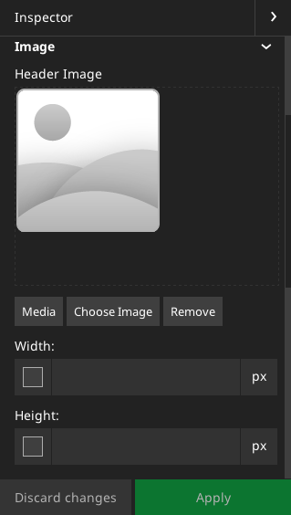

# Headerbild

Oben unter dem Menü gibt es ein Headerbild, welches wir im Folgenden dynamisieren wollen.

Die Idee dazu ist, dass wir das Bild in den Seiteneigenschaften pflegen wollen. Hierzu müssen wir die Node `Page` erweitern.


## NodeTypes.yaml

Dazu öffnen wir zunächst die Datei `Packages/Sites/Schulung.Website/Configuration/NodeTypes.yaml` und tragen hier den folgenden Code ein:

```
'TYPO3.Neos.NodeTypes:Page':
  ui:
    inspector:
      groups:
        image:
          label: 'Image'
          position: 20
  properties:
    headerimage:
      type: TYPO3\Media\Domain\Model\ImageVariant
      ui:
        label: 'Header Image'
        reloadIfChanged: true
        inspector:
          group: image
```



Wenn wir nun das Backend neuladen, kann man bereits die zugehörige Inspektor-Einstellungen sehen. Die zugehörige Seiteneigenschaft heisst nun  `headerimage` und kann entsprechend angesprochen werden.

Dies machen wir im HTML-Template:

Anstelle von dem folgenden Code:

```html
<section class="white centered no-padding">
	<div class="keyvisual"></div>
</section>
```

Schreiben wir nun diesen Code hinein:

```html
<section class="white centered no-padding">
	<f:if condition="{headerimage}">
		<f:then>
			<div class="keyvisual" style="background-image: url({media:uri.image(asset: headerimage)})"></div>
		</f:then>
		<f:else>
			<div class="keyvisual"></div>
		</f:else>
	</f:if>
</section>
```

Da wir hier den `media` Namespace verwenden, müssen wir diesen natürlich auch am Anfang der Datei deklarieren:

```html
<!DOCTYPE html>
{namespace neos=TYPO3\Neos\ViewHelpers}
{namespace media=TYPO3\Media\ViewHelpers}
...
```

Nun muss noch das Headerimage per TypoScript ans Template übertragen werden:

```
...
homepage = ${site}

headerimage = ${q(node).property('headerimage')}

parts {
...
```
