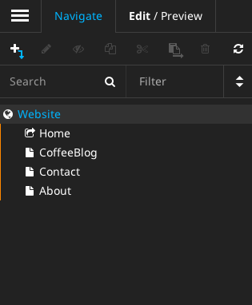

# Menu

## Seitenbaum anlegen

Damit ein Menu überhaupt Sinn macht, müssen wir zunächst einmal Seiten anlegen.



Achte darauf, dass die Seite `Home` lediglich ein Shortcut auf die Seite `Website` ist.


## Hauptmenu realisieren

Im TypoScript können wir nun das Menu innerhalb des Schlüssels `body` folgt realisieren:

```
...
body {
    parts {
        menu = Menu {
            templatePath = 'resource://Schulung.Website/Private/Templates/TypoScriptObjects/Menu.html'
            entryLevel = 1

            active.attributes.class = 'active'
            current.attributes.class = 'active'
        }
    }
    ...    
}
...
```

Nun legen wir das Verzeichnis `Package/Sites/Schulung.Website/Resources/Private/Templates/TypoScriptObjects` an und legen dorthinein eine Datei `Menu.html` mit folgendem Inhalt:

```
{namespace neos=TYPO3\Neos\ViewHelpers}
{namespace ts=TYPO3\TypoScript\ViewHelpers}
<nav class="collapse navbar-collapse" role="navigation">
    <f:render section="itemsList" arguments="{items: items}" />
</nav>

<f:section name="itemsList">
    <ul class="nav navbar-nav">
        <f:for each="{items}" as="item" iteration="menuIteration">
            <li{ts:render(path:'{item.state}.attributes') -> f:format.raw()}>
            <neos:link.node node="{item.node}">{item.label}</neos:link.node>
        </li>
        </f:for>
    </ul>
</f:section>
```

Im Template ersetzen wir nun folgenden Abschnitt:

```
<nav class="collapse navbar-collapse" role="navigation">
    <ul class="nav navbar-nav">
        <li class="active">
            <a href="MainTemplate.html">Home</a>
        </li>
        <li>
            <a href="CoffeeBlog.html">Coffee Blog</a>
        </li>
        <li>
            <a href="Contact.html">Contact</a>
        </li>
    </ul>
    <ul class="nav navbar-nav navbar-right">
        <li>
            <a href="About.html">About</a>
        </li>
    </ul>
</nav>
```

mit diesem hier:

```
{parts.menu -> f:format.raw()}
```

Vergleicht man das entstandene HTML, so fällt auf, dass noch etwas fehlt - der rechte Menüpunkt müsste ganz rechts am Rand auftauchen. Daher verändern wir unser `Menu.html` noch einmal:

```
{namespace neos=TYPO3\Neos\ViewHelpers}
{namespace ts=TYPO3\TypoScript\ViewHelpers}
<nav class="collapse navbar-collapse" role="navigation">
    <f:render section="itemsList" arguments="{items: items}" />
</nav>

<f:section name="itemsList">
    <ul class="nav navbar-nav">
        <f:for each="{items}" as="item" iteration="menuIteration">
            <f:if condition="{menuIteration.isLast}">
                    </ul>
                    <ul class="nav navbar-nav navbar-right">
            </f:if>
            <li{ts:render(path:'{item.state}.attributes') -> f:format.raw()}>
            <neos:link.node node="{item.node}">{item.label}</neos:link.node>
            </li>
        </f:for>
    </ul>
</f:section>

``` 

