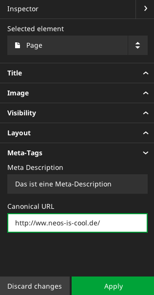

# Meta-Tags

Um die Seite mit Meta-Tags auszurüsten, werden wir ein eigenes Package implementieren. Natürlich könnte man dies auch im Site-Package machen. Allerdings ist ein eigenes Package leichter wieder verwendbar.


## Package kickstarten

Das Package können wir über die Kommandozeile anlegen:

```
$ ./flow kickstart:package Schulung.Meta
Created .../Schulung.Meta/Classes/Schulung/Meta/Controller/StandardController.php
Created .../Schulung.Meta/Resources/Private/Layouts/Default.html
Created .../Schulung.Meta/Resources/Private/Templates/Standard/Index.html
```

## Meta-Tag: Description

Wir wollen in der Seite ein Meta-Tag **Description** haben:


### NodeType für Description erweitern

Wir legen nun die Datei `NodeTypes.yaml` im Verzeichnis `Packages/Application/Schulung.Meta/Configuration/` mit folgendem Inhalt an:

```
'TYPO3.Neos.NodeTypes:Page':
  superTypes: ['TYPO3.Neos:Document']
  properties:
    metadescription:
      type: string
      ui:
        label: 'Meta Description'
        reloadIfChanged: TRUE
        inspector:
          group: 'metaOptions'
  ui:
    inspector:
      groups:
        metaOptions:
          label: 'Meta-Tags'
          position: 200
```

Damit können wir bereits die Seiteneigenschaften pflegen:


### TypoScript (Package)

Im Verzeichnis `Packages/Application/Schulung.Meta/Resources/Private/` legen wir nun ein Verzeichnis `TypoScripts` an und darin eine Datei `Root.ts` mit folgendem Inhalt:

```
page.head.metadata {
	description = TYPO3.TypoScript:Tag {
	tagName = 'meta'
	attributes {
		name = 'description'
		content = TYPO3.TypoScript:Value
		content.value = ${q(node).property('metadescription')}
	}
}
```

### TypoScript (Site)

Dieses TypoScript müssen wir nun in der Datei `Packages/Application/Schulung.Meta/Resources/Private/TypoScript/Root.ts2` inkludieren - dazu tragen wir folgenden Code möglichst weit vorne ein:

```
include: resource://Schulung.Meta/Private/TypoScript/Root.ts2

namespace: TS=TYPO3.TypoScript
...
```

Weiter unten in der Datei müssen wir nun nur noch dafür Sorge tragen, dass die Sektion `meta` auch angesprochen wird:

```
...
	head {
		stylesheets = TS:Template {
			...
		}
		metadata = TS:Template {
			templatePath = 'resource://Schulung.Website/Private/Templates/Page/MainTemplate.html'
			sectionName = 'metadata'
		}
	}
	body {
```

### HTML-Template (Site)

Im HTML-Template der Site müssen wir nun noch im Head-Bereich dafür sorgen, dass der Meta-Bereich angesprochen werden kann:

```html
...
	<head>
		<meta charset="utf-8">
		<meta http-equiv="X-UA-Compatible" content="IE=edge,chrome=1">
		<title>Little Bean Roastery</title>
		<meta name="description" content="">
		<meta name="viewport" content="width=device-width, initial-scale=1">

		<f:section name="meta">
			{description -> f:format.raw()}
		</f:section>

		<f:section name="stylesheets">
			...
		</f:section>
	</head>
	...
```

### Abfrage, ob Description gesetzt ist

Nun können wir noch abfragen, ob die Beschreibung überhaupt gesetzt ist:

Dazu gehen wir in die Datei `Packages/Application/Schulung.Meta/Resources/Private/TypoScript/Root.ts2`:

```
content = ${q(node).property('metadescription') ? q(node).property('metadescription') : 'Keine Beschreibung'}
```

oder

```
content = ${q(node).property('metadescription') ? q(node).property('metadescription') : Configuration.setting('Schulung.Meta.Description')}
```

In diesem Fall allerdings benötigen wir noch eine Datei `Packages/Application/Schulung.Meta/Configuration/Settings.yaml` mit dem folgenden Inhalt:

```
Schulung:
  Meta:
    Description: 'Das ist eine Default-Description'
```


## Canonical URL

Weiter geht es mit dem Wunsch, eine Canonical-URL eingeben zu können - diese soll in der folgenden Form angezeigt werden:

```html
<link rel="canonical" href="http://www.lobacher.de/canonical" />
```


### NodeType für Canonical-URL erweitern

Wir erweitern nun die Datei `NodeTypes.yaml` im Verzeichnis `Packages/Application/Schulung.Meta/Configuration/` mit folgendem Inhalt:

```
...
  properties:
    metadescription:
      type: string
      ui:
        label: 'Meta Description'
        reloadIfChanged: TRUE
        inspector:
          group: 'metaOptions'
    canonicalUrl:
      type: string
      ui:
        label: 'Canonical URL'
        reloadIfChanged: TRUE
        inspector:
          group: 'metaOptions'
  ui:
...
```

Nun können wir im Inspektor bereits das neue Feld sehen:




### TypoScript erweitern (Package)

Wir ergänzen nun das TypoScript unter `Packages/Application/Schulung.Meta/Resources/Private/TypoScript/Root.ts2`:

```
page.head.metadata {
	description = TYPO3.TypoScript:Tag {
		...
	}
	canonicalTag = TYPO3.TypoScript:Template {
		templatePath = 'resource://Schulung.Meta/Private/Templates/TypoScript/CanonicalTag.html'
		canonicalUrl = ${q(node).property('canonicalUrl')}
	}
}
```

### HTML-Template (Package)

Hier verwenden wir das Template-Objekt von TypoScript - daher müssen wir nun auch ein Template anlegen. Dafür legen wir zunächst den Ordner `TypoScript` innerhalb von `Packages/Application/Schulung.Meta/Resources/Private/Templates` an und erstellen dort eine Datei `CanonicalTag.html` mit dem folgenden Inhalt:

```html
{namespace ts = TYPO3\TypoScript\ViewHelpers}

<link rel="canonical" href="{ts:render(path: 'canonicalUrl')}" />
```

### HTML-Template (Site)

Nun müssen wir noch das Site-Template `` entsprechend anpassen:

```html
<f:section name="metadata">
	{description -> f:format.raw()}
	{canonicalTag -> f:format.raw()}
</f:section>
```
### Übung

* Zur Übung kann man den Canonical-Tag nur dann ausgeben lassen, wenn er gesetzt ist
* Weitere Übung: Die URL enthält immer die aktuelle Seite, es sei denn, sie wird überschrieben

### ACHTUNG

Der Canonical-Tag wird nun im Body ausgegeben - dies liegt daran, dass um das Tag herum Content (z.B. Leerzeichen) ausgegeben werden.

Idee:

```
page.head.metadata.canonicalTag = ${'<link rel="canonical" href="' + q(node).property('canonicalUrl') + '" />'}
```

## Übung

Es soll eine Funktionalität `noindex` und `nofollow` realisiert werden:

```html
<meta name="robots" content="noindex, nofollow">
```
