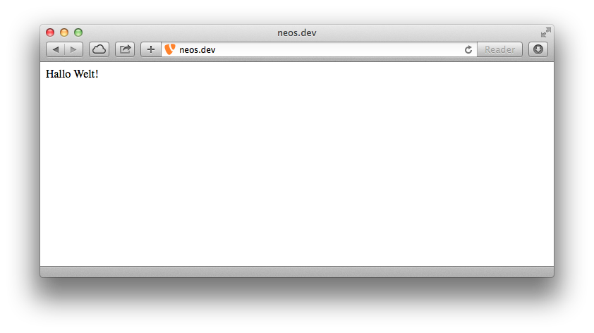

# Neuanlegen einer Site

Prinzipiell gibt es zwei Möglichkeiten eine neue Site anzulegen.

## Neos Backend

Klicke hierzu links auf das Menü-Symbol und wähle ganz unten **Sites Management** aus. 


Nun deaktivieren wir die (eventuell bestehende) Site **TYPO3 Neos Demo Site** durch Klick auf das Minus-Symbol ganz rechts. Über **Add new site** legen wir anschließend eine neue Site an. Dort vergeben wir folgende Daten:

**Package Key:** 

> Schulung.Website

**Site Name:** 

> website


Nun öffnen wir die Datei `Packages/Sites/Schulung.Website/Resources/Private/TypoScripts/Library/Root.ts` und schreiben folgenden Code ganz ans Ende der Datei:

```
page >
page = 'Hallo Welt!'
```

Im Frontend sollte nun **Hallo Welt!** erscheinen.




## Flow Kommandozeile

```
$ ./flow kickstart:site Schulung.Website Website
Created .../Sites.xml
Created .../Root.ts2
Created .../Default.html
Created .../NodeTypes.yaml
```

Anschließend muss man die Site importieren:

```
$ ./flow site:import --package-key Schulung.Website
Import finished.
```

### Weitere Befehle

Man kann nun z.B. alle auf dem System befindlichen Sites auflisten:

```
$ ./flow site:list
```