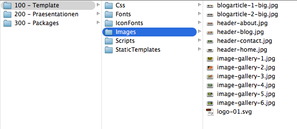

# Statisches Template integrieren

## Umkopieren der statischen Ressourcen

Im Verzeichnis `100 - Template` findest Du die statischen Dateien für das Tutorial:



Um diese nun umkopieren zu können, benötigen wir ein neues Verzeichnis:

```
$ mkdir Packages/Sites/Schulung.Website/Resources/Public
```

Kopiere nun die statischen Dateien komplett in das neue Verzeichnis `Public`.


## Umkopieren des Templates

Zuerst benennen wir das bestehende Page-Template um:

```
$ mv Packages/Sites/Schulung.Website/Resources/Private/Templates/Page/Default.html Packages/Sites/Schulung.Website/Resources/Private/Templates/Page/Default_ORIG.html
```

Nun kopieren wir das statische Template `MainTemplate.html` um:

```
$ cp Packages/Sites/Schulung.Website/Resources/Public/StaticTemplates/MainTemplate.html Packages/Sites/Schulung.Website/Resources/Private/Templates/Page/
```


## Ansprechen per TypoScript

Das Haupt-TypoScript befindet sich immer an der selben Stelle:

`Packages/Sites/Schulung.Website/Resources/Private/TypoScripts/Library/Root.ts2`

Benennen wir daher die bestehende um und legen eine neue Datei an:

```
$ mv Packages/Sites/Schulung.Website/Resources/Private/TypoScripts/Library/Root.ts2 Packages/Sites/Schulung.Website/Resources/Private/TypoScripts/Library/Root_ORIG.ts2
$ touch Packages/Sites/Schulung.Website/Resources/Private/TypoScripts/Library/Root.ts2
```

In diese Datei `Root.ts2` tragen wir nun folgenden Code ein:

```
page = TYPO3.Neos:Page {

  body {
    templatePath = 'resource://Schulung.Website/Private/Templates/Page/MainTemplate.html'
  }

}
```

Nun wird das Template bereits geladen - allerdings komplett (also inkl. `<html>`-Tag) - dies wollen wir so allerdings nicht.


## Teile des Templates ansprechen

Um nun nur eine Teil des Templates anzusprechen (nämlich alles innerhalb des `<body>`-Tags), kann man eine sogenannte Fluid-Section verwenden.

Tragen wir zunächst ins TypoScript folgenden Befehl innerhalb des `body`-Schlüssels ein:

```
  body {
    ...
    sectionName = 'body'
    ...
  }

```

Im Template müssen wir nun die Sektion ebenfalls nachrüsten:

```
...
<body>
    <f:section name="body">
      <div class="full-height">
       ...
    </f:section>
</body>
...
```


## JavaScript-Includes im Footer korrigieren

Nun müssen die JavaScript-Includes im Footer korrigiert werden:

Alt:
```
<script src="../Scripts/Vendor/Bootstrap/transition.js"></script>
<script src="../Scripts/Vendor/Bootstrap/carousel.js"></script>
```

Neu:
```
<script src="{f:uri.resource(path: 'Scripts/Vendor/Bootstrap/transition.js', package: 'Schulung.Website')}"></script>
<script src="{f:uri.resource(path: 'Scripts/Vendor/Bootstrap/carousel.js', package: 'Schulung.Website')}"></script>
```

Oder:

```
<script src="../../../Public/Scripts/Vendor/Bootstrap/transition.js"></script>
<script src="../../../Public/Scripts/Vendor/Bootstrap/carousel.js"></script>
```

Durch Zufügen des richtige Pfads (`../../Public/`) erkennt Neos dies automatisch als öffentliche Resource und wird diese automatisch umkopieren und verlinken.

Zielpfad ist dann beispielsweise `http://neos02.dev/_Resources/Static/Packages/Schulung.Website/Scripts/Vendor/Bootstrap/carousel.js`


## Headbereich einrichten

Da wir nun vermehrt auf TypoScript-Objekte zugreifen müssen, können wir zunächst an den Anfang unserer `root.ts2` Datei eine Namespace Deklaration anbringen:

```
namespace: TS=TYPO3.TypoScript
```

Nun sprechen wir den Head-Bereich an, indem wir dort das **Template-Objekt** verwenden (über den Namespace **TS**), damit das generelle Template laden und dort die Sektion `stylesheets` ansprechen:

```
...
head {
  stylesheets = TS:Template
  stylesheets {
    templatePath = 'resource://Schulung.Website/Private/Templates/Page/MainTemplate.html'
    sectionName = 'stylesheets'
  }
}
body {
  ...
```

Zurück im Template müssen wir nun die eben angesproche Sektion `stylesheets` eingeben:

Alt:
```
<link href='http://fonts.googleapis.com/css?family=Lato:300,400,300italic,400italic' rel='stylesheet' type='text/css'>
<link rel="stylesheet" href="../Css/main.css">
```

Neu:
```
<f:section name="stylesheets">
    <link href='http://fonts.googleapis.com/css?family=Lato:300,400,300italic,400italic' rel='stylesheet' type='text/css'>
    <link rel="stylesheet" href="../../../Public/Css/main.css">
</f:section>
```

## Kennzeichnung des Body-Tags, ob Unterseiten existieren

Check, ob aktuelle Seite Unterseiten hat:
```
page {
  bodyTag {
    attributes.class = ${q(node).children().count() > 1 ? 'has-subpages' : ''}
  }
}
```

Check, ob aktuelle Seite vom Typ `Page` ist:

```
page {
  bodyTag {
    attributes.class = ${q(node).filter('[instanceof TYPO3.Neos:Page]') != '' ? 'is-page' : ''}
  }
}
```
